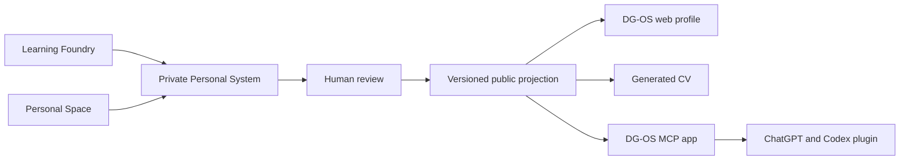

# DG-OS Product Roadmap

Status: living product document  
Last updated: 1 August 2026  
Current proof: Dessi Georgieva is the first profile instance.

This document records the product direction, boundaries, sequencing, and decisions that should survive individual builds. `APP_ROADMAP.md` remains the detailed implementation backlog for the existing portfolio application.

Related decision: [`AION_REUSE_ASSESSMENT.md`](./AION_REUSE_ASSESSMENT.md) records which Gateplane authentication, workspace, project, and agent-governance capabilities can support DG-OS.

## 1. Product purpose

DG-OS gives a person a controlled way to turn private learning, work, questions, and decisions into a public professional record.

The private system remembers broadly. The public system says less. What appears publicly has been reviewed, bounded, and connected to evidence.

The first proof uses Dessi's own work. A successful proof should help a visitor understand:

- what Dessi can do;
- how that competence developed;
- what supports each material claim;
- where uncertainty or confidentiality remains;
- how her projects, ideas, and experience connect over time.

The larger product can later support many people, employers, collaborators, and investors. That later network must grow from a credible personal system rather than a directory of generated profiles.

## 2. The two active projects

### DG-OS

The public projection and discovery layer.

Responsibilities:

- render an approved human profile as an explorable operating system;
- expose systems, evidence, evolution, writing, CVs, and public links;
- provide a platform entrance for discovering profile instances;
- serve approved profile data to web visitors and authorised AI clients;
- preserve provenance, limitations, and version history.

### Personal System

The future unified desktop application containing the Learning Foundry and Personal Space.

Responsibilities:

- observe approved local projects and learning sources;
- support learning, reflection, association, and experimentation;
- retain private evidence locally by default;
- prepare possible public claims and profile changes;
- require human review before anything reaches DG-OS.

Learning Foundry remains unchanged on GitHub while its hackathon submission is under review through 12 August 2026. Shared contracts can be designed outside that repository during this period.

## 3. Invariants

These rules should survive changes in framework, cloud provider, or model provider.

1. Private material is canonical locally.
2. DG-OS receives an explicit public projection, never an unrestricted mirror of local activity.
3. AI may collect, organise, compare, and propose. A human approves publication.
4. Every material public claim carries provenance, scope, confidence, and a limitation when one exists.
5. A generated CV is a view of the same profile projection, not a separate source of truth.
6. The data contract remains provider-neutral. OpenAI is the first interface, not the owner of the record.
7. Public visitors can understand the profile without using AI or learning the OS metaphor first.
8. No competence score, cultural-fit score, or candidate ranking enters the proof of concept.

## 4. Product architecture

The first shared contract is `ProfileProjection`. It should eventually contain:

- identity and public contact details;
- current direction and availability;
- capabilities expressed as bounded claims;
- projects, roles, contributions, outcomes, and limitations;
- evidence references and visibility levels;
- learning and evolution entries approved for publication;
- public relationships between systems, ideas, and experiences;
- CV views and assets;
- projection version, publication time, and review metadata.

## 5. Delivery roadmap

### Phase 0 - Complete the Dessi proof

Status: in progress.

- finish the current narrative and interface review;
- retain the OS shell and Creative Machine entrance;
- make Systems & Evidence, Evolution, Workbench, Writing, Timeline, Map, Connect, and Agents read as parts of one system;
- finish responsive window behaviour and core accessibility checks;
- keep claims conservative where public evidence is limited.

Exit condition: a new visitor can explain DG-OS, Dessi's current professional direction, and the relationship between evidence and evolution after one visit.

### Phase 1 - Make Dessi an instance of a profile contract

Status: in progress. The public contract, registry, canonical route, and first projection are live.
Workbench and Evidence/Evolution now use a validated, versioned module bundle shared by the public
UI and Profile Agent. Writing and Network use independent validated v1 modules so they can evolve
without changing the frozen profile-modules v1 schema. All four shared modules now resolve beneath
the selected public profile handle and fail closed when either the profile or module is unavailable.
Remaining profile content still needs to cross the boundary.

- define and validate `ProfileProjection`;
- move Dessi-specific content behind one profile boundary;
- remove Dessi-specific assumptions from shared components, terminal commands, routes, and navigation;
- generate the standard CV from the projection;
- retain application-specific CVs as explicit, derived views;
- add projection version and last-reviewed metadata.

Exit condition: the renderer can load a second fixture profile without editing shared interface components.

### Phase 2 - Add the DG-OS platform entrance

Status: in progress. The root browser now introduces the product, publication method, and first live
profile before a visitor enters Dessi's personal OS.

- turn the simulated browser home into the DG-OS platform page;
- introduce Dessi as `Instance 01`;
- provide summary, evidence areas, CV access, and `Enter Dessi's OS`;
- route the personal system to `/dessi` or `/@dessi`;
- transition from the browser directory into the selected person's OS;
- use a conventional list and search model as the accessible discovery surface;
- reserve a relationship graph for real, evidence-supported connections.

Exit condition: the root domain represents DG-OS as a product while Dessi's profile remains the complete live proof.

### Phase 3 - Connect the private Personal System

- define a signed, versioned projection bundle;
- build a local review queue and publication preview;
- export only approved public fields and assets;
- receive the projection through a narrow DG-OS API;
- preserve previous public versions and support rollback;
- record publication consent and actor identity.

Exit condition: a reviewed change made locally updates Dessi's public profile without manually editing portfolio source files.

### Phase 4 - Add the OpenAI interface

- implement one MCP contract shared by ChatGPT and Codex;
- package it as a DG-OS plugin with focused skills and an authenticated app;
- begin with read-only tools for profile inspection and private reflection;
- allow AI to prepare a projection change without publishing it;
- keep final publication inside the Personal System approval surface;
- preserve adapters for later model providers.

Exit condition: Dessi can ask Codex or ChatGPT to inspect her workspace and prepare a bounded update while publication remains human-controlled.

### Phase 5 - Pilot a second person

- introduce accounts, workspaces, and memberships;
- add an identity provider and OAuth for the DG-OS MCP app;
- store account, projection, version, and permission metadata in Postgres;
- enforce tenant boundaries in the API and database;
- store approved cloud assets separately from private local material;
- test onboarding, export, deletion, recovery, and consent with one invited user.

Exit condition: a second person can create and maintain an isolated profile without Dessi or a developer editing code for them.

### Phase 6 - Build the network carefully

- add profile discovery by evidenced capabilities, domains, questions, and availability;
- introduce relationships only when both their meaning and provenance are clear;
- add employer and collaborator views after the individual controls are stable;
- design feedback, correction, appeal, and deletion before automated assessment;
- test whether the system improves understanding and opportunity, not merely profile engagement.

Exit condition: the network creates useful introductions while profile owners retain control over interpretation and disclosure.

## 6. Decision gates

Do not add infrastructure because the final architecture might need it. Add it when the proof crosses a boundary.

| Decision                                 | Trigger                                                            |
| ---------------------------------------- | ------------------------------------------------------------------ |
| Add authentication and a hosted database | A second real user begins onboarding                               |
| Add private cloud storage                | A user explicitly chooses multi-device sync or backup              |
| Add write-capable MCP tools              | Read-only use is stable, scoped, logged, and understood            |
| Add a profile graph                      | Real profiles and meaningful relationships exist                   |
| Add employer assessment                  | Consent, correction, evidence, and appeal rules are designed       |
| Add another AI provider                  | A real user need or dependency risk justifies the adapter          |
| Split services or databases per tenant   | Isolation, scale, or compliance needs exceed shared infrastructure |

## 7. Information boundaries

| Layer             | Examples                                                               | Default location                    | Publication rule                     |
| ----------------- | ---------------------------------------------------------------------- | ----------------------------------- | ------------------------------------ |
| Local private     | source code, notes, failures, raw activity, unpublished ideas          | user's device                       | never public by default              |
| Cloud private     | encrypted backups, optional sync, private approved workspace data      | authenticated private storage       | explicit user choice                 |
| Public projection | reviewed claims, selected evidence, projects, public evolution entries | DG-OS                               | explicit approval and version record |
| Public assets     | generated CV, selected images, public documents                        | public or controlled object storage | generated from approved projection   |

Secrets, tokens, raw private evidence, local paths, employer-confidential material, and unreviewed model output must never enter the public repository.

## 8. Open-source position

The code can remain public during the proof. Openness fits the educational purpose and makes the architecture inspectable. The business should not depend on hiding the renderer.

The durable split should be:

### Open permanently

- the `ProfileProjection` specification;
- the public profile renderer;
- local import and export formats;
- self-hosting documentation;
- MCP contracts and safety conventions;
- core Personal System modules that let an individual retain control of their record.

### Possible commercial layer

- managed hosting and synchronisation;
- identity, recovery, administration, and support;
- trusted publication and verification operations;
- discovery and relationship infrastructure;
- employer workflows and organisation controls;
- abuse prevention, moderation, and operational tooling;
- service-level guarantees and regulated deployments.

Private user data is never part of the open-source asset. The defensible product grows from trust, operation, distribution, governance, and useful participation. Code secrecy alone would contribute little to that defence.

### Licence decision

DG-OS software is licensed under `AGPL-3.0-only`. AGPL preserves commercial use while requiring operators of modified network versions to offer their corresponding source to users. It does not prevent another company from operating a competing service. A licence that forbids competitors or production use is source-available rather than open source.

The repository should therefore:

1. remain public during the Dessi proof;
2. retain the full AGPL text and SPDX metadata in every distributed software package;
3. expose a visible source and licence link from the deployed interface;
4. manage contributor rights before accepting outside contributions if a separate commercial licence may later be offered;
5. protect the DG-OS name, visual identity, and hosted trust service separately from the code licence;
6. give profile content, personal data, and media explicit terms rather than assuming the software licence covers them.

This is a product recommendation, not legal advice. A solicitor should review the licence structure before external contributors, customers, or investors rely on it.

References:

- [GitHub: licensing a repository](https://docs.github.com/en/repositories/managing-your-repositorys-settings-and-features/customizing-your-repository/licensing-a-repository)
- [Open Source Initiative: Open Source Definition](https://opensource.org/osd)
- [Open Source Initiative: AGPL-3.0](https://opensource.org/license/agpl-3-0)
- [Choose a License: MIT](https://choosealicense.com/licenses/mit/)
- [MariaDB: Business Source License 1.1](https://mariadb.com/bsl11/)

## 9. Immediate build sequence

The next DG-OS work should proceed in this order:

1. completed: migrate Writing into a reviewed public profile module;
2. completed: model Network as profile-owned nodes and typed, evidenced relationships;
3. completed: extend profile-aware routing to Workbench, Writing, Evolution, and Network;
4. next: make the standard CV builder accept a profile handle and explicit variant;
5. generate the general CV from the same approved profile data;
6. specify the signed local publication bundle and narrow API boundary;
7. keep authentication and hosted workspaces behind the second-real-user gate.

Aion integration remains deferred until the second-user gate. Its stable identity, workspace, project, delegated-grant, approval, and audit patterns may shape the contracts without introducing an authentication dependency into the current proof.

## 10. Product measures for the proof

The proof should answer observable questions:

- Can a visitor describe Dessi's actual work without relying on a job title?
- Can they distinguish public evidence, self-reported material, and confidential boundaries?
- Can Dessi update the profile through reviewed source material rather than duplicate editing?
- Can the same approved record produce the OS, CV, and AI-readable profile?
- Does the system create a useful conversation, interview, collaboration, or investment introduction?
- Can Dessi remove or correct a public claim cleanly?

Traffic and time-on-site may help diagnose usability. They do not prove that the system understands a person.

## 11. Decision record

### 1 August 2026

- Treat DG-OS and the unified Personal System as the two active projects.
- Complete DG-OS first, using Dessi as the live proof.
- Keep raw personal material local by default.
- Publish only reviewed profile projections.
- Keep OpenAI as the first interface while retaining provider-neutral contracts.
- Keep the code public during the proof.
- Licence DG-OS software under `AGPL-3.0-only`.
- Keep the DG-OS identity, profile content, personal data, and media outside the software licence unless explicitly stated.
- Resolve contribution and trademark terms before wider participation.
