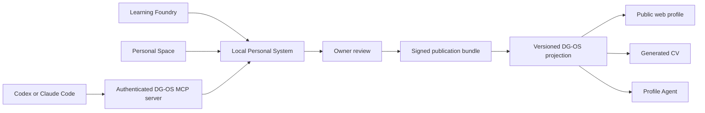

# DG-OS Product Roadmap

- Status: living product document
- Last reviewed: 4 August 2026
- Current phase: Publication Bundle v1
- Current proof: Dessi Georgieva is the first public profile instance

This is the canonical product sequence. It records what DG-OS is becoming, which boundaries must
survive the build, and what must be true before the next capability enters the system. Detailed
engineering rules live under [`engineering/`](./engineering/). Historical portfolio plans live
under [`archive/`](./archive/).

## Product purpose

DG-OS gives a person a controlled way to turn private learning, work, questions and decisions into
a public professional record.

The private system remembers broadly. The public system says less. What appears publicly has been
reviewed, bounded and connected to evidence. A visitor can inspect the record without accepting a
generated claim on trust. The owner can revisit the same record to understand change, prepare new
work and decide what should remain private.

Dessi is the first proof because she is building and using the system. The proof succeeds when it
helps another person understand:

- what she has built and can do;
- how that competence developed;
- what supports each material claim;
- where evidence is limited or confidential;
- how projects, ideas and experience connect over time.

The longer product direction includes personal workspaces, AI-client connections, invited profiles
and employer or collaborator surfaces. Those capabilities follow the evidence and control model.
They do not precede it.

## Product surfaces

### DG-OS

The public projection and discovery surface.

It:

- renders an approved profile as an explorable operating system;
- exposes Workbench, Evidence and Evolution, Writing, Network, Resume and Profile Agent views;
- presents the platform before a visitor enters an individual profile;
- generates CVs from the same approved record;
- preserves version, provenance, confidence and limitation boundaries;
- later serves approved data to authenticated AI clients.

### Personal System

The planned local application formed from the Learning Foundry and Personal Space.

It will:

- observe sources explicitly selected by the owner;
- support learning, reflection, association and experimentation;
- retain private evidence locally by default;
- prepare candidate claims and public changes;
- show the exact publication diff;
- require human approval before data reaches DG-OS.

The Learning Foundry hackathon repository remains unchanged on GitHub until its review period ends
on 12 August 2026. Integration contracts can be designed here without changing that repository.

## Completed foundation

The portfolio refactoring is complete enough to begin the expansion build:

- `/` introduces DG-OS as a product and profile directory;
- `/@dessi` is the canonical responsive profile route;
- profile identity and public metadata use a validated projection contract;
- Workbench, Evidence and Evolution, Writing, Network and Resume are versioned profile modules;
- the Profile Agent retrieves evidence from the selected profile boundary;
- deterministic terminal commands fail closed for unknown profiles;
- the general CV is generated from approved profile records;
- committed Markdown, DOCX and PDF assets are protected by an artifact manifest;
- architecture, contract, state-machine and interaction checks run in CI;
- Vercel Firewall protects provider-backed Profile Agent requests.

Some compatibility routes and Dessi-owned knowledge remain. They are tracked in
[`DESSI_PROFILE_DEPENDENCY_INVENTORY.md`](./DESSI_PROFILE_DEPENDENCY_INVENTORY.md) and do not block
the publication contract.

## Invariants

These rules survive changes in framework, cloud provider and model provider.

1. Raw personal material is canonical locally.
2. DG-OS receives an explicit public projection, never an unrestricted mirror of private activity.
3. AI may collect, organise, compare and propose. A human approves publication.
4. Every material public claim carries provenance, scope, confidence and a limitation when one
   exists.
5. Generated CVs and agent evidence are views of the approved profile, not separate truths.
6. User and workspace identity remain independent of OpenAI, Anthropic or another AI provider.
7. Codex and Claude Code are clients acting under DG-OS scopes. Their provider sessions do not own
   the workspace.
8. Public visitors can understand a profile without using AI or learning the OS metaphor first.
9. Unknown profiles, modules, workspaces, versions and permissions fail closed.
10. Competence scores, cultural-fit scores and candidate ranking remain outside the proof.

## Target architecture

The detailed ownership, persistence, publication and OAuth boundaries are defined in
[`engineering/WORKSPACE_PUBLICATION_ARCHITECTURE.md`](./engineering/WORKSPACE_PUBLICATION_ARCHITECTURE.md).

## Delivery roadmap

### Phase 0 - Establish the Dessi public proof

Status: completed baseline.

The product entrance, canonical profile, shared public modules, Profile Agent boundary,
deterministic CV generation and engineering harness are live.

Remaining interface refinements are normal product work. They no longer define the architectural
critical path.

### Phase 1 - Define Publication Bundle v1

Status: next.

- define a versioned provider-neutral bundle envelope;
- reference only supported public record versions;
- define canonical digest and signature verification;
- record profile, workspace, base version and proposed version;
- distinguish human preparation from Codex or Claude Code preparation;
- bind approval to one immutable bundle digest;
- reject secrets, local paths, private identifiers in public records and unsupported algorithms;
- add contract fixtures, privacy tests and deterministic verification.

Exit condition: a local fixture can prepare, sign and verify an approved Dessi update without
changing the active public profile.

### Phase 2 - Build the Personal System review surface

- unify the Learning Foundry and Personal Space around shared local contracts;
- import sources only with explicit owner selection;
- create a private review queue and readable diff;
- separate observations, model proposals and owner-approved statements;
- export Publication Bundle v1 without exposing unrestricted workspace contents;
- keep signing keys in the local operating-system keychain or equivalent secure store.

Exit condition: Dessi can prepare and approve a publication bundle from the local application.

### Phase 3 - Add the narrow DG-OS publication receiver

- verify bundles without activating them;
- add immutable version storage and an audit record;
- enforce optimistic version checks and idempotency;
- preview the resolved public projection and assets;
- activate one approved version through a deterministic publication state machine;
- support correction and rollback without deleting history.

Exit condition: a reviewed local change updates Dessi's profile without manually editing public
content files, and the previous version can be restored.

### Phase 4 - Introduce accounts and isolated workspaces

Trigger: the first invited external user begins onboarding.

- add stable users and provider-neutral identity connections;
- allocate personal workspaces and explicit memberships;
- connect the bounded Gateplane control-plane API described by ADR-0001;
- enforce tenant and workspace isolation in the API and persistence layer;
- add recovery, export, deletion and revocation;
- keep optional cloud sync separate from public publication.

Exit condition: an invited person can sign in, receive an isolated workspace and control its public
projection without a developer editing code.

### Phase 5 - Connect AI clients through MCP

- implement one authenticated remote MCP contract;
- connect Codex first with read and proposal scopes;
- connect Claude Code through the same resources, tools and authorization semantics;
- allow clients to inspect approved scope and prepare a bundle;
- keep human approval and publication outside model authority;
- audit allowed, denied and revoked tool use.

Exit condition: an authorised client can prepare a bounded change for the selected workspace and
cannot read another workspace or publish directly.

### Phase 6 - Run the second-person pilot

- test onboarding with one invited participant;
- test local-only operation and optional sync;
- test source selection, correction, withdrawal, export and account deletion;
- observe whether the public profile supports a useful opportunity or collaboration;
- revise the product from actual use rather than hypothetical scale.

Exit condition: the second person can maintain an accurate public record without Dessi acting as
their operator.

### Phase 7 - Add discovery and organisation surfaces carefully

- introduce profile discovery by evidenced capabilities, domains, questions and availability;
- add relationships only when their meaning, consent and provenance are clear;
- design employer and collaborator views after individual controls are stable;
- define correction, appeal and deletion before any automated assessment;
- evaluate whether the system improves understanding and opportunity.

Exit condition: discovery creates useful introductions while profile owners retain control over
interpretation and disclosure.

## Decision gates

Infrastructure enters when a product boundary requires it.

| Decision                                       | Trigger                                                                           |
| ---------------------------------------------- | --------------------------------------------------------------------------------- |
| Enable the publication receiver                | Local verification, idempotency, version conflict and rollback tests pass         |
| Add hosted authentication and database storage | The first invited external user begins onboarding                                 |
| Add private cloud storage                      | A user explicitly chooses backup or multi-device sync                             |
| Enable MCP proposal tools                      | Workspace scopes, audit and revocation are enforced independently of model output |
| Add an agent publication scope                 | No current plan; requires a new decision and threat model                         |
| Add another public profile                     | The shared renderer and evidence registry pass with an isolated second fixture    |
| Add profile relationships                      | Real profiles and consented, evidenced relationships exist                        |
| Add employer assessment                        | Evidence, consent, correction, appeal and deletion policies are implemented       |
| Split services or databases                    | Isolation, scale or compliance exceeds the safe shared design                     |

## Information boundaries

| Layer                | Examples                                                             | Default location                       | Publication rule              |
| -------------------- | -------------------------------------------------------------------- | -------------------------------------- | ----------------------------- |
| Local private        | Source code, notes, failures, raw activity, unpublished ideas        | Owner device                           | Never public by default       |
| Cloud private        | Optional encrypted backup, membership and draft metadata             | Authenticated private services         | Explicit owner choice         |
| Publication envelope | Reviewed diff, target version, asset digests, approval and signature | Local device plus private audit record | Valid bundle only             |
| Public projection    | Approved claims, projects, evidence and evolution                    | DG-OS version store                    | Explicit activation           |
| Public assets        | Generated CV and selected public documents                           | Public or controlled object storage    | Derived from approved version |

Secrets, provider tokens, signing private keys, raw private evidence, local paths,
employer-confidential material and unreviewed model output never enter the public projection.

## Open-source position

DG-OS remains `AGPL-3.0-only`. The public contracts, renderer, local formats, MCP safety conventions
and self-hosting path can remain inspectable. A managed service may charge for identity, recovery,
synchronisation, trusted publication, discovery, moderation and operational guarantees.

The software licence does not grant rights to the DG-OS name, personal profile content, CV content,
original writing or personal media. Contributor and trademark terms require legal review before
outside contributions or investment depend on them.

## Current build acceptance

Publication Bundle v1 is complete only when:

- the schema and canonical representation are versioned;
- a committed valid fixture verifies deterministically;
- modified payloads and signatures fail;
- unsupported record or algorithm versions fail;
- private paths, secrets and internal identifiers cannot enter public records;
- profile, workspace and base-version mismatches fail;
- repeated verification produces the same result;
- the publication state machine is documented but no activation endpoint is exposed;
- `pnpm test:harness` and `pnpm check` pass without weakening architecture budgets.

## Measures for the proof

- Can a visitor describe Dessi's actual work without relying on a job title?
- Can they distinguish public evidence, owner-reported material and confidential boundaries?
- Can Dessi update the profile through reviewed source material rather than duplicate editing?
- Can one approved version produce the OS, CV and AI-readable evidence?
- Can she correct or withdraw a public claim without losing history?
- Does the profile create a useful interview, collaboration or investment conversation?
- Can an invited second person operate the same system without data crossing profiles?

Traffic and time on site may diagnose usability. They do not prove that the system understands a
person.

## Decision record

### 4 August 2026

- Mark the public-profile refactoring and engineering harness as the completed foundation.
- Start the expansion with Publication Bundle v1 rather than login or hosted storage.
- Prepare provider-neutral provenance for Codex and Claude Code without implementing provider login.
- Keep DG-OS account identity separate from AI-provider sessions.
- Connect hosted identity and workspaces only when the first invited external user needs them.
- Use one MCP authorization contract for Codex and Claude Code, with no initial publish scope.
- Preserve old portfolio plans under `docs/archive/`.

### 1 August 2026

- Treat DG-OS and the unified Personal System as the two active product surfaces.
- Complete DG-OS first with Dessi as the live proof.
- Keep raw personal material local by default.
- Publish only reviewed profile projections.
- Keep the code public during the proof under `AGPL-3.0-only`.
