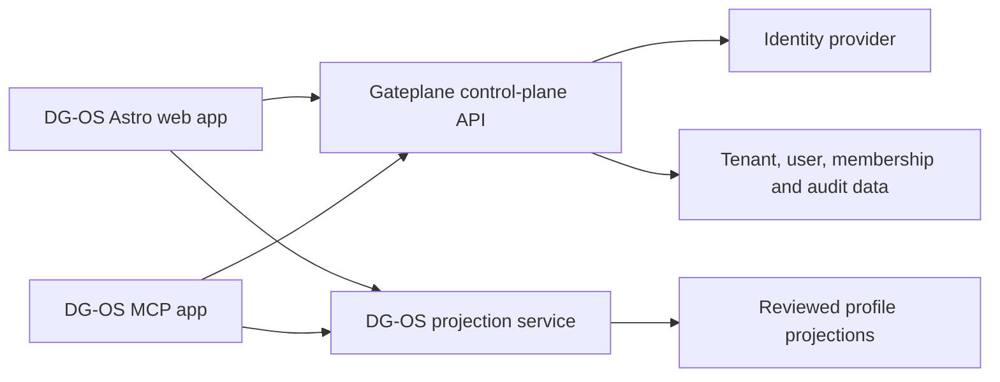

# Archived Aion / Gateplane Reuse Assessment

- Status: archived 4 August 2026
- Decision extracted to:
  [`../engineering/decisions/0001-gateplane-control-plane-boundary.md`](../engineering/decisions/0001-gateplane-control-plane-boundary.md)
- Last assessment: 1 August 2026
- Source reviewed: local Aion repository at its 1 August 2026 state

This assessment records the repository investigation behind ADR-0001. Its implementation snapshot
and test counts are historical. ADR-0001 is the durable architectural decision.

## Decision

Aion contains substantial infrastructure that DG-OS can reuse when the second-user pilot begins. It should remain a bounded identity and authorization control plane. DG-OS should consume its API contracts rather than copy its Python internals into the Astro application.

No Aion runtime dependency is needed for the current single-person proof. The immediate DG-OS work remains the `ProfileProjection` boundary and Dessi instance migration.

## Strong reuse candidates

| Aion capability                         | DG-OS use                                                        | Reuse mode                          | Timing                     |
| --------------------------------------- | ---------------------------------------------------------------- | ----------------------------------- | -------------------------- |
| OIDC provider abstraction               | Sign in with Google, Entra, or another provider                  | Keep behind the Gateplane API       | Second-user pilot          |
| JWT sessions and revocation             | Web and MCP session control                                      | Keep behind the Gateplane API       | Second-user pilot          |
| Tenant isolation                        | Prevent data crossing account or organisation boundaries         | Reuse policy and database patterns  | Second-user pilot          |
| Workspaces and memberships              | Give each person an isolated private workspace                   | Reuse after membership model review | Second-user pilot          |
| Project CRUD and repositories           | Organise private source projects and approved context            | Reuse domain/API concepts           | Personal System connection |
| Documents and storage ports             | Register evidence files without binding to one storage vendor    | Reuse ports and metadata model      | Personal System connection |
| Agent identities and delegated grants   | Scope what Codex or ChatGPT may read or propose                  | Reuse domain model                  | MCP integration            |
| Approval requests and single-use tokens | Require human approval for sensitive agent actions               | Adapt for publication approval      | MCP integration            |
| Audit events                            | Record authentication, access, proposal, and publication actions | Reuse event pattern                 | Before external users      |
| Clean architecture boundaries           | Keep providers, storage, and frameworks outside product rules    | Reuse as an architectural rule      | Now                        |

## Mapping into DG-OS

The concepts are related but their names do not always mean the same thing.

| Aion              | DG-OS interpretation                                                                  |
| ----------------- | ------------------------------------------------------------------------------------- |
| Tenant            | Billing or governance boundary: initially one personal account; later an organisation |
| User              | Authenticated human identity                                                          |
| Workspace         | Private personal or organisational working boundary                                   |
| Project           | Private source container that may contribute evidence                                 |
| Document          | Private or approved evidence artifact                                                 |
| Agent             | AI principal acting under a human-controlled grant                                    |
| Agent export      | Candidate output requiring review; never automatically a public profile change        |
| Public projection | New DG-OS resource; it does not currently exist in Aion                               |

A DG-OS public project is a reviewed claim-bearing projection. An Aion project is a private collaboration and context container. They should not share one database table merely because both are called `project`.

## What should not move into DG-OS

- legacy agency, client, brand, and market hierarchy fields;
- `primary_client_id` as the canonical tenant identifier;
- enterprise plan and capability-pack complexity during the proof;
- local password authentication unless a concrete need appears;
- Gateplane's React marketing and configuration-console interface;
- Bedrock ingestion and sandbox execution infrastructure;
- internal tenant configuration screens;
- project sharing rules that assume tenant membership equals workspace membership.

## Changes required before direct reuse

### Identity

Aion currently places one `auth_provider` on the user. DG-OS users may connect several identities and AI providers over time. Introduce a separate identity connection model:

- `user_id`;
- `provider`;
- `provider_subject`;
- verified email and profile claims;
- encrypted token reference where required;
- scopes, connection time, last use, and revocation state.

The user remains stable when a provider changes.

### Tenant and workspace

Replace legacy client terminology with explicit `tenant_id`. Treat workspace membership as a first-class relation with role and status. Do not assume one workspace per tenant in repository contracts.

Workspace-visible project access must verify membership in the specific workspace, not only membership in the same tenant.

### Projects

Retain Aion's useful project properties:

- stable identifier;
- owner and workspace;
- visibility;
- soft deletion;
- optimistic version;
- timestamps and activity;
- repository ports and tenant-scoped queries.

Add DG-OS-specific boundaries elsewhere:

- evidence relationships;
- review status;
- projection eligibility;
- confidentiality and publication policy.

### Publication approval

Aion's agent approval requests are designed for high-risk tool actions. The mechanics can support DG-OS, but public publication needs its own domain event and review object:

- proposed projection version;
- exact field and evidence diff;
- proposing actor and source;
- reviewer decision;
- approval time and expiry;
- published version or rejection reason;
- rollback target.

The approval token may authorise one publication action. It must not become a general write token.

## Recommended integration shape

Boundaries:

- Gateplane owns authentication, sessions, users, tenants, memberships, delegated agent access, and access audit.
- DG-OS owns profile projections, claims, evidence semantics, CV generation, and public rendering.
- The Personal System owns raw private material and publication review.
- A generated TypeScript client should consume Gateplane's OpenAPI contract. Handwritten copies of Python domain models should be avoided.

## Sequence

### Now

1. Do not add login or a database to the Dessi proof.
2. Define `ProfileProjection` without importing Aion code.
3. Reserve internal ownership fields in the projection envelope without exposing them publicly.
4. Reuse Aion's language of stable IDs, versions, provenance, soft deletion, and audit.

### Before the second user

1. Generalise Aion's user, tenant, identity-connection, membership, and workspace contracts.
2. Add contract tests for cross-tenant and cross-workspace denial.
3. expose the minimum hosted auth/session API required by DG-OS;
4. generate a TypeScript client from the OpenAPI document;
5. connect a private DG-OS preview before enabling public registration.

### Before MCP write actions

1. Map DG-OS tool scopes onto Aion delegated grants.
2. Keep the first integration read-only.
3. Add proposal and publication approval as separate actions.
4. Audit every allowed, denied, approved, rejected, and consumed action.

## Verification performed

The review inspected Aion's domain entities, repository ports, database migrations, row-level security policies, provider abstraction, session/JWT stack, API route standards, project policies, agent grants, approval requests, and workspace import/export boundaries.

The following targeted suites passed on 1 August 2026:

- workspace entity tests;
- user entity tests;
- workspace and project policy tests;
- project validation and listing use-case tests;
- session manager tests;
- JWT token manager tests.

Result: 82 passed, 16 warnings.

## Licence compatibility

Aion currently uses MIT. MIT-licensed code can be incorporated into an AGPL-3.0-only work while its copyright and licence notice are retained. Because the same owner controls both repositories, Aion may also be relicensed separately later. That decision should be made for Aion as its own product rather than implied by the DG-OS licence change.
