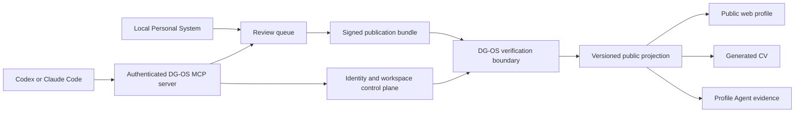

# Workspace and Publication Architecture

- Status: target architecture, implementation begins with Publication Bundle v1
- Last reviewed: 4 August 2026
- Related decision: [`decisions/0001-gateplane-control-plane-boundary.md`](./decisions/0001-gateplane-control-plane-boundary.md)

## Purpose

DG-OS exposes a small, reviewed public record. The future Personal System retains a much larger
private record on the owner's device. This document defines how information may cross that boundary
and how hosted accounts, isolated workspaces, Codex and Claude Code can be added without making an
AI provider the owner of a person's identity or record.

This is a target architecture. The current application has one public profile, no account login,
no hosted private workspace and no publication endpoint.

## System boundaries



The boundaries have separate authority:

- The Personal System owns raw projects, learning records, notes, failures and unpublished ideas.
- The profile owner approves the exact public projection.
- DG-OS validates, versions and renders approved public data.
- The control plane owns user identity, sessions, workspace membership and delegated access.
- AI clients may inspect approved scope and prepare proposals. They do not grant themselves
  publication authority.

## Identity model

DG-OS identity remains stable when an external provider changes. Signing into Codex or Claude Code
authenticates those clients to their providers. It does not establish ownership of a DG-OS
workspace.

The minimum hosted model is:

```text
User
  id
  status
  created_at

IdentityConnection
  id
  user_id
  provider
  provider_subject
  verified_claims
  connected_at
  revoked_at

Workspace
  id
  owner_user_id
  slug
  status
  created_at

WorkspaceMembership
  workspace_id
  user_id
  role
  status
  version
```

`provider_subject` is opaque. Provider access and refresh tokens, when required, are encrypted or
held behind a secret reference. They never enter a public projection, publication bundle, browser
payload or repository.

The first person normally receives one personal workspace. The schema does not assume one
workspace per user because later organisational workspaces may have several members.

## Publication Bundle v1

The immediate build introduces a provider-neutral envelope prepared locally:

```ts
type PublicationBundleV1 = {
  schemaVersion: 'dg-os.publication-bundle/v1';
  bundleId: string;
  workspaceId: string;
  target: {
    profileId: string;
    handle: string;
    baseProjectionVersion: number;
    proposedProjectionVersion: number;
  };
  createdAt: string;
  preparedBy:
    | {
        kind: 'human';
        actorId: string;
        provider: null;
        client: 'manual';
      }
    | {
        kind: 'agent';
        actorId: string;
        provider: 'openai' | 'anthropic' | 'local';
        client: 'codex' | 'claude-code' | 'manual';
        installationId: string;
      };
  records: readonly {
    kind: 'profile' | 'profile-modules' | 'network' | 'writing' | 'resume';
    schemaVersion: string;
    recordId: string;
    profileId: string;
    handle: string;
    projectionVersion: number;
    recordVersion: number;
    sha256: string;
    byteLength: number;
  }[];
  assets: readonly {
    assetId: string;
    mediaType: string;
    sha256: string;
    byteLength: number;
  }[];
  approval: {
    approvedByUserId: string;
    approvedAt: string;
    method: 'local-signature';
  };
  integrity: {
    canonicalization: 'rfc8785';
    digestAlgorithm: 'sha256';
    signatureAlgorithm: 'ed25519';
    keyId: string;
    digest: string;
    signature: string;
  };
};
```

The implemented v1 contract narrows each record kind to its existing public schema version and
requires exactly one profile record. Other module kinds are optional but unique. Every record and
asset reference pins canonical bytes by SHA-256 digest and byte length. The payload bytes are not
embedded in the envelope and cannot be replaced without invalidating the signature.

The signature covers a canonical representation of every field except the signature value itself.
The v1 implementation uses RFC 8785 canonical JSON, SHA-256 and Ed25519 through established
libraries and the Node.js cryptography implementation. Unknown algorithms fail validation. No
custom cryptography is permitted.

Internal ownership identifiers may exist in the signed envelope and server-side version record.
They must be removed from the public profile projection and all client-hydrated public surfaces.

## Publication state machine

```text
draft -> prepared -> reviewed -> approved -> publishing -> published -> superseded
                   \-> rejected            \-> failed
published -> rollback-requested -> rolled-back
```

Required invariants:

1. Only a valid bundle with a recognised schema, digest and signature can enter `reviewed`.
2. The approving user must own or hold an explicit publication role in the target workspace.
3. Approval identifies one immutable bundle digest and cannot authorise later edits.
4. `publishing` is idempotent by `bundleId` and target version.
5. A version conflict rejects the request instead of overwriting a newer projection.
6. Published versions are immutable. Correction creates a new version.
7. Rollback activates a previous version and records a new event. It does not erase history.
8. Model output cannot change evidence scope, approval, permissions or transition state directly.

The state machine must be added to the executable catalogue before the publication API is enabled.

## Narrow publication API

The receiver surface is introduced in stages. The implemented read-only boundary exposes:

```text
POST /api/v1/publications/verify
```

Later stateful publication may add:

```text
POST /api/v1/publications
GET  /api/v1/publications/{bundleId}
```

`verify` performs schema, identity, signature, privacy and reference-metadata checks without
changing the active profile. It resolves the verification key from an exact trusted binding across
workspace, profile, handle, approving user and key ID. A bundle cannot supply or register its own
trust root. This stateless check proves the signed manifest is internally valid; it does not claim
that referenced record or asset bytes are present. Those bytes must be resolved and matched before
any later preview or activation. Rejected responses contain bounded issues and never reflect the
submitted payload.

The route requires a bounded JSON body, a separately published Vercel Firewall rule and trusted
server configuration. It is stateless and does not enter `reviewed`, activate a projection or write
an audit record. `POST /api/v1/publications` is deferred until persistence and rollback exist. When
it is introduced, it accepts one approved bundle and returns the existing result for a repeated
idempotency key.

Externally integrated HTTP contracts begin under `/api/v1`. The URL version governs transport,
authentication and resource semantics, while `dg-os.publication-bundle/v1` and
`dg-os.publication-verification/v1` independently version the submitted and returned data. Additive,
backward-compatible fields remain in `/api/v1`; a breaking HTTP contract requires a new major path.
First-party implementation routes such as Profile Agent chat are not retroactively presented as
public platform APIs.

The API route validates and delegates. Canonicalisation, verification, state transitions,
authorization and persistence belong in services or future bounded domains, never inside the route
component.

## AI-client authorization

Codex and Claude Code should connect to the same remote MCP resource server through OAuth. DG-OS or
its chosen identity provider authenticates the user and issues DG-OS-scoped tokens. The system does
not import or reuse the user's OpenAI or Anthropic session token.

Initial scopes:

```text
workspace:read
draft:write
bundle:prepare
bundle:verify
```

There is no agent `publish` scope in the first integration. Human approval remains a separate,
signed action.

Connection records contain an opaque installation identity, workspace, client, granted scopes and
revocation state. Public profile data contains none of these fields.

## Persistence boundaries

| Data                             | Initial location                       | Hosted location when justified                |
| -------------------------------- | -------------------------------------- | --------------------------------------------- |
| Raw source code and notes        | Owner device                           | Optional encrypted storage chosen by owner    |
| Draft claims and associations    | Personal System                        | Private workspace database if sync is enabled |
| Publication bundles              | Owner device and receiver audit record | Private object storage plus metadata database |
| Public projection versions       | Current repository-backed registry     | Versioned projection store                    |
| Public assets                    | Repository static assets               | Content-addressed public object storage       |
| Sessions, memberships and grants | None in the current proof              | Control-plane database                        |
| Provider credentials             | Local keychain or server secret store  | Encrypted secret reference only               |

Postgres may hold account, workspace, membership, publication and version metadata. Object storage
holds larger approved bundles and assets. Neither store receives unrestricted local workspace
contents by default.

## Architecture impact

Publication implementation affects contracts, state machines, services, API routes and interaction
tests. Before adding source files:

1. add explicit publication contract and runtime responsibilities to the architecture manifest;
2. preserve the direction `contracts -> validated data -> services -> API/UI adapters`;
3. keep signing and storage providers behind interfaces;
4. add contract fixtures and privacy tests;
5. add transition, replay, conflict, idempotency and rollback tests;
6. add cross-workspace denial tests before hosted workspaces exist;
7. record any dependency-budget increase in an ADR instead of changing the baseline silently.

## Delivery sequence

| Stage | Capability                                                               | Runtime authentication                            |
| ----- | ------------------------------------------------------------------------ | ------------------------------------------------- |
| 1     | Publication Bundle v1, canonical digest, local verification and fixtures | None                                              |
| 2     | Local review queue and publication preview in the Personal System        | Local owner control                               |
| 3     | Narrow receiver, version storage, idempotency and rollback               | Deployment credential for the single-person proof |
| 4     | User, identity, workspace and membership runtime                         | Hosted user session                               |
| 5     | Remote MCP server with Codex connection                                  | OAuth to DG-OS                                    |
| 6     | Claude Code connection through the same scopes and tools                 | OAuth to DG-OS                                    |
| 7     | Invited second-person pilot                                              | Isolated hosted workspace                         |

Contracts for later stages may be prepared early. Runtime infrastructure enters only when the
preceding authority and isolation boundaries are testable.

## Explicit non-goals for Publication Bundle v1

- public registration or login;
- hosted private workspace storage;
- automatic repository watching;
- direct publication by Codex, Claude Code or any model;
- employer assessment, competence scoring or ranking;
- importing provider session tokens;
- merging the Personal System repositories into this application.
